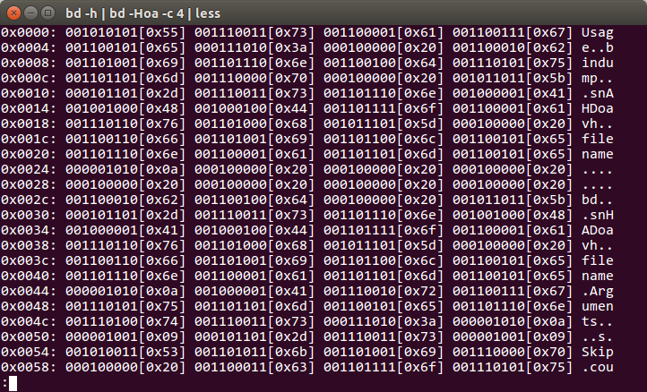

# Binary dump utility

<p align="right">
   <a href="COPYING">
   
   </a>
</p>

This is small and simple utility to view binary dumps of any
files you need. I needed it for viewing eeprom-images for my
avr-microcontrollers projects. May be it would be useful for
some of your purposes, either way I publishing it here.

<p align="center">
   
</p>

Features:

- Show sets of bytes in binary presentation
- Skipping variable bytes from start(by args)
- Shows variable count of bytes(by args)
- Shows hexadecimal bytes values
- Shows ascii bytes values
- Shows offsets for easier file navigation
- Use stdin and stdout, so you can easily send and save any
  data you need

---

<sub>
This project can be used out-of-the-box for simple purposes,
if you want serious tool to manage, writing binary data, this
would be useless.
</sub>

## How to install
```bash
$ git clone https://github.com/inickey/bindump && cd bindump
$ make
$ sudo make install
```
If you using Ubuntu GNU/Linux, you can install this software
from my ppa, it'll be faster and easier
```bash
$ sudo add-apt-repository ppa:inickey/ppa
$ sudo apt-get update
$ sudo apt-get install bindump
```

## How to uninstall
```bash
$ sudo make uninstall
```

## How to use it?

```bash
# Dump the file
$ bindump my_file.bin

# Dump the stdin
$ cat my_file.bin | bindump

# Use pager for big files
$ cat my_big_file.bin | bindump | less
```

## Which flags can I use?

To configure output you can use this flags:
```
-s      [count] Skips count of bytes from the start
-l      [count] Sets the length of bytes to show
-c      [count] Sets the count of bytes to show in one line
-A              Turn on the ASCII values near the binaries
                like 001110010[r]
-H              Turn on the hex values near the binaries
-D              Turn on the decimal values near the binaries
-S              Do not split bytes, show all together
-o              Turn on offsets in start of each line
-a              Turn on the ASCII values in ending of each line
-v              Shows version
-h              Shows help
```

---

<sub>
Actually it was written on-the-knee in about one hour, so I don't still
know will I make any changes here or not. It is published under the free
GPLv3 license, so you free to fork and change it if you need for any
purpose, but I think it'll be faster and better to write your own.
</sub>
